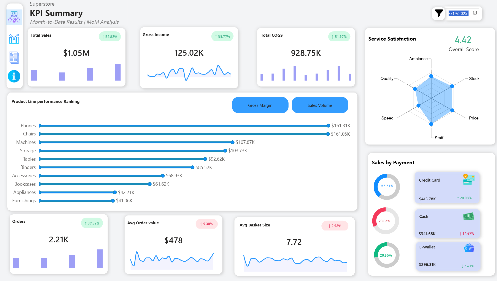
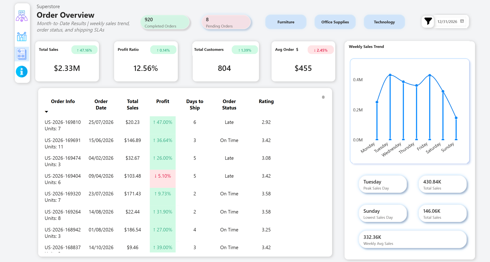
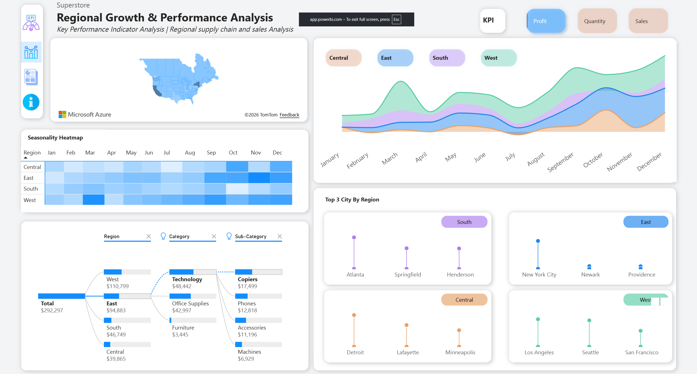

# Superstore Power BI Analysis

This project is a Power BI analysis of a Superstore dataset. It includes dashboards for KPI summary, order overview, and regional analysis.

## Dashboards

### KPI Summary

### Order Overview

### Regional Analysis

## Files
- **Superstore.pbix**: The Power BI project file.
- **Recording_superstore_dashboard.mp4**: A video recording of the dashboard in action.

## How to View
You can view the reports by opening `Superstore.pbix` in Power BI Desktop.
